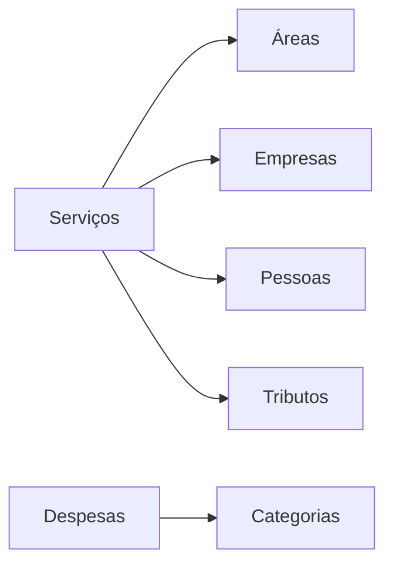

# 🏢 Dashboard Empresa Junior - Business Intelligence

<div align="center">
  
  
  
  
</div>

<div align="center">
  <h3>💡 Sistema completo de análise financeira e operacional para Empresas Juniores</h3>
  <p><i>Transforme dados em decisões inteligentes</i></p>
</div>

---

## 🎯 **Sobre o Projeto**

O **Dashboard EJ** é uma ferramenta especializada desenvolvida para auxiliar **Empresas Juniores** na gestão e análise de seus dados financeiros e operacionais. Com uma interface moderna e intuitiva, o sistema oferece insights valizosos sobre projetos, receitas, despesas e performance geral da EJ.

## ✨ **Funcionalidades Principais**

### 📊 **KPIs Inteligentes**

-   **💰 Receita Total & Líquida**: Controle financeiro completo
-   **🎯 Gestão de Projetos**: Acompanhamento de status e áreas
-   **💼 Análise de Clientes**: Segmentação por área de atuação
-   **📈 Ticket Médio**: Valor médio por projeto
-   **✅ Taxa de Conclusão**: Performance operacional

### 📈 **Visualizações Interativas**

-   **📅 Evolução Temporal**: Receita mensal com tendências
-   **🎯 Projetos por Área**: Distribuição de demanda
-   **📊 Status de Projetos**: Acompanhamento em tempo real
-   **🏢 Análise de Clientes**: Mapeamento por segmento
-   **💰 Controle Tributário**: Carga por área e projeto
-   **💸 Gestão de Despesas**: Categorização e controle

### 🔍 **Filtros Dinâmicos**

-   **📆 Período**: Análise temporal flexível
-   **🎯 Área de Projeto**: Foco em especialidades
-   **✅ Status**: Acompanhamento por fase

## 🚀 **Instalação Rápida**

### 1️⃣ **Clone o Repositório**

```bash
git clone https://github.com/gnobisP/commitJr_BI.git
cd commitJr_BI
```

### 2️⃣ **Configure o Ambiente** (Recomendado)

```bash
# Criar ambiente virtual
python3 -m venv venv

# Ativar ambiente
source venv/bin/activate  # Linux/Mac
# venv\Scripts\activate   # Windows
```

### 3️⃣ **Instalar Dependências**

```bash
pip install -r requirements.txt
```

### 4️⃣ **Executar Dashboard**

```bash
python app.py
```

🎉 **Pronto!** Acesse: `http://localhost:8050`

## 📁 **Estrutura de Dados**

O sistema utiliza dados específicos da EJ organizados na pasta `fake_data/`:

```
fake_data/
├── 📋 area_projeto.csv    # Áreas de atuação da EJ
├── 🏢 empresa.csv         # Dados dos clientes
├── 👤 pessoa.csv          # Contatos das empresas
├── 🎯 servico.csv         # Projetos realizados
├── 💸 despesa.csv         # Gastos operacionais
└── 💰 tributo.csv         # Impostos por projeto
```

### 🔗 **Relacionamentos**



## 🎨 **Interface**

<div align="center">
  <h4>🖥️ Design Moderno e Profissional</h4>
  <ul style="list-style: none;">
    <li>🎨 <b>Tema EJ</b>: Cores e identidade visual personalizada</li>
    <li>📱 <b>Responsivo</b>: Funciona em desktop, tablet e mobile</li>
    <li>⚡ <b>Performance</b>: Carregamento rápido e fluido</li>
    <li>🎯 <b>Intuitivo</b>: Interface simples e fácil de usar</li>
  </ul>
</div>

## 🔧 **Personalização**

### 🎨 **Alterar Cores**

Edite o arquivo `config.py`:

```python
COLORS = {
    'primary': '#1E40AF',    # Sua cor principal
    'secondary': '#7C3AED',  # Cor secundária
    'accent': '#F59E0B',     # Cor de destaque
    # ...
}
```

### 📊 **Adicionar KPIs**

1. Calcule a métrica no callback
2. Crie o card visual
3. Adicione ao layout

### 🎯 **Customizar Filtros**

Modifique as opções nos componentes `dcc.Dropdown`

## 📊 **Exemplos de Métricas**

| Métrica             | Descrição                 | Cálculo                      |
| ------------------- | ------------------------- | ---------------------------- |
| **Receita Total**   | Soma de todos os projetos | `Σ valor_projetos`           |
| **Receita Líquida** | Receita após tributos     | `receita_total - tributos`   |
| **Ticket Médio**    | Valor médio por projeto   | `receita_total ÷ n_projetos` |
| **Taxa Conclusão**  | % de projetos finalizados | `concluídos ÷ total × 100`   |

## 🛠️ **Tecnologias**

-   **🐍 Python 3.8+**: Linguagem principal
-   **📊 Dash**: Framework web interativo
-   **📈 Plotly**: Visualizações avançadas
-   **🐼 Pandas**: Análise de dados
-   **🧮 NumPy**: Computação numérica

## 🎯 **Roadmap**

### ✅ **Implementado**

-   [x] Dashboard interativo
-   [x] KPIs financeiros
-   [x] Análise de projetos
-   [x] Controle tributário
-   [x] Gestão de despesas
-   [x] Interface responsiva

### 🔮 **Próximas Versões**

-   [ ] 📱 App móvel
-   [ ] 🔐 Sistema de login
-   [ ] 📧 Relatórios em PDF
-   [ ] 🔔 Notificações automáticas
-   [ ] 🤖 Previsões com IA
-   [ ] 🔄 API REST
-   [ ] ☁️ Deploy na nuvem

## 🤝 **Contribuindo**

Contribuições são bem-vindas! Siga os passos:

1. **Fork** o projeto
2. **Clone** seu fork
3. **Crie** uma branch: `git checkout -b feature/nova-funcionalidade`
4. **Commit** suas mudanças: `git commit -m 'Adiciona nova funcionalidade'`
5. **Push** para a branch: `git push origin feature/nova-funcionalidade`
6. **Abra** um Pull Request

## 📞 **Suporte**

<div align="center">

| Canal               | Link                                                                     |
| ------------------- | ------------------------------------------------------------------------ |
| 🐛 **Issues**       | [GitHub Issues](https://github.com/gnobisP/commitJr_BI/issues)           |
| 📖 **Documentação** | [Wiki do Projeto](https://github.com/gnobisP/commitJr_BI/wiki)           |
| 💬 **Discussões**   | [GitHub Discussions](https://github.com/gnobisP/commitJr_BI/discussions) |

</div>

## 📄 **Licença**

Este projeto está sob a licença **MIT**. Veja o arquivo [LICENSE](LICENSE) para mais detalhes.

---

<div align="center">
  <h3>🚀 Desenvolvido com ❤️ para Empresas Juniores</h3>
  <p><i>"Dados inteligentes, decisões acertadas"</i></p>
  
  <a href="#top">⬆️ Voltar ao topo</a>
</div>
